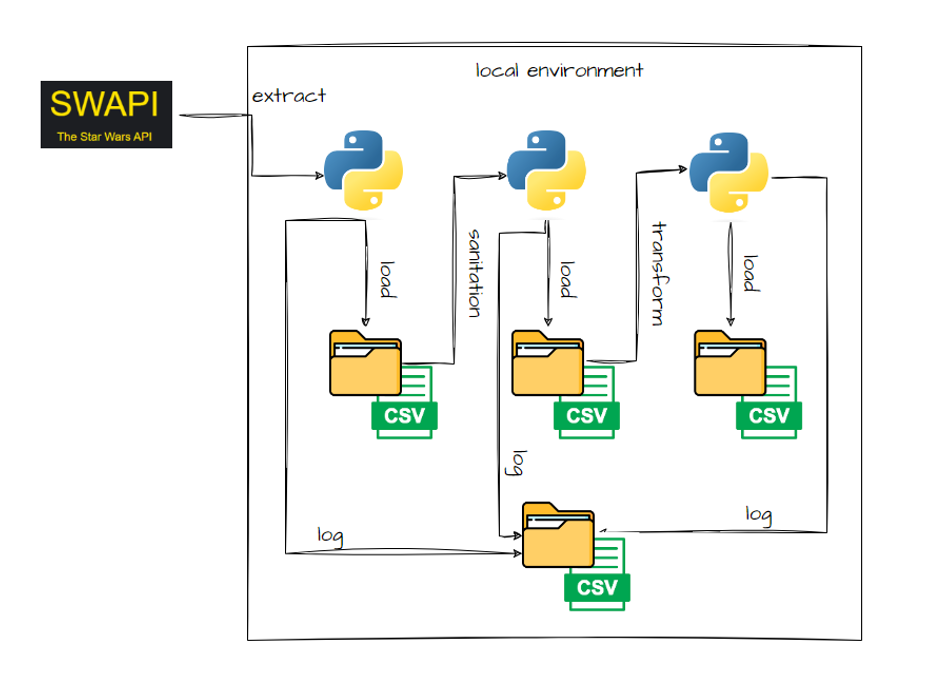

## *CRIAÇÃO DE PIPELINE UTILIZANDO PYTHON*

## Projeto Final
1. [Introdução](#introdução)
2. [Estrutura do Projeto](#estrutura-do-projeto)
3. [Origem dos Dados](#origem-dos-dados)
4. [Requisitos](#requisitos)

## Introdução

Projeto desenvolvido durante a aula de DataOps do curso de MBA de Engenharia de dados, oferecido pela faculdade Impacta.

Neste projeto abordamos os seguintes temas:
- Conceito de DataOps
- Níveis de maturidade de projetos em Engenharia de Dados
- Tecnologias em Engenharia de Dados
- Princípios e boas práticas em projetos de Engenharia de Dados
- Orquestração e monitoramento

## Estrutura do projeto
O projeto consiste em uma aplicação simples dos conceitos vistos em sala de aula. Foi desenvolvido um pipeline completo da seguinte forma:

## Origem dos dados
- https://swapi.dev/api/people/?
- https://swapi.dev/api/planets/?
- https://swapi.dev/api/films/?

## Requisitos
- Formato da tabela de entrega: csv 
- Frequência de atualização do dado: frequência de 1x por dia
- Parâmetro de coleta: 1 página por requisição
- Salvar logs do processo
- Armazenamento dos dados brutos
- Armazenamento dos dados saneados: Tratamento de tipos, nomes e nulos
- Armazenamento dos dados agregados e tratados
- Validação de qualidade de dados: Validação de duplicados e Tolerância de nulos
- Orquestração realizada via airflow

## Observações Finais
- Foi adaptado o código desenvolvido em aula para que seja possível percorrer todas as páginas da API sem a obrigatoriedade da utilização do Apache AirFlow, conforme autorizado pela professora a não obrigatoriedade do uso da ferramenta.
- Foram gerados arquivos .json na pasta “raw” com os dados extraídos da API. Cada arquivo possui 10 ítens. 
- Não foi gerado nenhum arquivo log por não ter ocorrido nenhum erro, mas no script consta a tratativa.
- Além dos arquivos CSV gerados na pasta “work”, ao final é gerado o “sw.csv” na pasta “dw” (data warehouse).
- Para rodar o código 'main.py', recomendo a exclusão de todo conteúdo presente dentro das pastas "dw", "raw" e "work".

